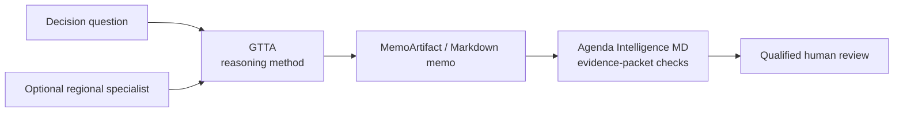

# Global Think Tank Analyst (`gtta`)

[](https://github.com/vassiliylakhonin/global-think-tank-analyst/actions/workflows/ci.yml)
[](LICENSE)

**An experimental strategic-risk reasoning framework for AI agents, with
versioned memo contracts, CLI, and MCP.**

Global Think Tank Analyst turns broad questions about policy, sanctions,
regulation, trade, geopolitics, and strategic risk into decision-shaped memos.
It makes evidence boundaries, assumptions, uncertainty, actor incentives,
options, and watch indicators explicit.

[Use the skill](SKILL.md) · [Read the Russian version](SKILL_RU.md) ·
[See examples](examples/README.md) · [Inspect project status](STATUS.md)

**Current maturity: `R2 / M3 / U0`.** A tested GitHub release candidate, an
executable method contract, and a disclosed paired evaluation run exist.
No practitioner validation or production reliability is claimed.

> GTTA improves analytical structure; it does not establish factual truth. It
> is not legal, compliance, sanctions, financial, investment, or trading
> advice. Verify current sources and use qualified human review before acting.

## Try it in one prompt

Attach [`SKILL.md`](SKILL.md) to a capable agent, then paste:

```text
Use Global Think Tank Analyst.

Question: What does regulatory uncertainty change for our market-entry decision?
Decision this informs: enter now, run a limited pilot, or wait.
Audience: operating committee.
Geography: [countries or markets].
Time horizon: 12 months.
Evidence mode: reasoning-only unless live sources are available.
Depth: standard memo.

Separate facts, assumptions, assessments, scenarios, and unknowns.
Tag every material claim with its provenance.
Give options, trade-offs, indicators, confidence, and what would change the judgment.
```

The skill works without the Python package. This is the simplest and most
mature way to use the method.

## What it does

- Frames analysis around a concrete decision, audience, geography, and time
  horizon.
- Separates facts, assessments, assumptions, scenarios, and unknowns.
- Uses per-claim provenance tags: `[primary]`, `[secondary]`,
  `[user-provided]`, `[inference]`, and `[analyst-judgment]`.
- Calibrates language to evidence and confidence.
- Models actors, incentives, leverage, options, trade-offs, scenarios, and
  observable triggers.
- Supports seven response modes, from a quick brief to competing hypotheses.
- Exposes the same method through agent instructions, Python, CLI, and MCP.
- Provides deterministic checks for method structure and a strict structured
  memo artifact for machine-readable workflows.

## What it is not

- Not a source-retrieval system or real-time intelligence feed.
- Not a factuality verifier.
- Not an autonomous decision-maker.
- Not a substitute for legal, sanctions, compliance, financial, or domain
  review.
- Not externally practitioner-validated or production-proven.
- Not a generic multi-agent platform; the optional LangGraph pipeline is an
  experiment around the core reasoning method.

## Install and use

### Use the instructions directly

Add [`AGENTS.md`](AGENTS.md) and [`SKILL.md`](SKILL.md) to an agent workspace,
or attach `SKILL.md` to a conversation. English and Russian instructions are
both packaged in the wheel, but they are not equivalent: `SKILL.md` is the
canonical method and `SKILL_RU.md` is a **partial** rendering of it — 9 of 45
sections, with Mode D, Mode F and Mode G undefined. Use `language="ru"` for
Russian-language output of the modes it covers; use the English method when the
full contract matters. The gap is stated in `SKILL_RU.md` itself and checked by
`scripts/validate_language_parity.py`.

### Install the developer toolkit from source

The package is a source-installed pre-release while PyPI account recovery is
pending.

```bash
git clone https://github.com/vassiliylakhonin/global-think-tank-analyst.git
cd global-think-tank-analyst
python3.11 -m venv .venv
source .venv/bin/activate
python -m pip install -e ".[mcp]"
```

```bash
# Generate a memo scaffold
gtta new --mode B --topic "Market-entry regulatory exposure"

# Heuristically check a Markdown memo
gtta check-contract memo.md --mode B

# Inspect, validate, and render the strict structured artifact
gtta artifact-schema
gtta check-artifact memo.json --json
gtta render-artifact memo.json > memo.md

# Serve the method and artifact tools over MCP stdio
gtta mcp
```

The latest GitHub candidate is
[`v1.5.0rc1`](https://github.com/vassiliylakhonin/global-think-tank-analyst/releases/tag/v1.5.0rc1).
Development on `main` is `1.6.0.dev0`.

## Executable analysis contracts

GTTA separates checks that answer different questions:

| Layer | Interface | What it can establish | What it cannot establish |
|---|---|---|---|
| Markdown method preflight | [`gtta-method-contract@1.1`](docs/contract-checker.md) | Required declarations, mode shape, confidence, likely untagged claims, generic advice | Claim boundaries, factuality, source support |
| Structured memo | [`gtta.memo@1.0`](docs/memo-artifact.md) | Claim IDs, provenance, source references, dependency links, mode invariants, canonical rendering | Whether a named source is trustworthy or supports the claim |
| Evidence packet | [Agenda Intelligence MD](https://github.com/vassiliylakhonin/agenda-intelligence-md) | Claim/source packet completeness, declared quotes, lexical support, unmatched numbers | Factual truth or professional approval |
| Operational decision | Human review | Contextual judgment, current-source verification, accountability | Guaranteed correctness |

`MemoArtifact` is the canonical machine-readable GTTA seam. Its claim ledger is
shared by the Python API, CLI, and MCP tools; Markdown is the rendered human
view.

## Memo modes

| Mode | Use it for | Required shape |
|---|---|---|
| **A — Quick Brief** | Fast orientation | Bottom line, risks, watch indicators, confidence |
| **B — Standard Memo** | Default decision analysis | Context, actors, assessment, options, change conditions |
| **C — Scenario Brief** | Divergent futures | Baseline, scenarios, triggers, implications, indicators |
| **D — Red-Team Challenge** | Stress-testing a claim | Target claim, alternatives, failure modes, revised judgment |
| **E — Decision Pack** | Team action | Memo, options, watchlist, owner questions, next steps |
| **F — Analyst Training** | Developing reasoning | Coaching and Socratic challenge rather than a finished answer |
| **G — Competing Hypotheses** | Attribution and rival explanations | Hypotheses, evidence matrix, disconfirmation, sensitivity, bounded judgment |

## Before and after

A generic answer:

> The environment is uncertain. Monitor developments, engage stakeholders,
> remain agile, and review the strategy regularly.

A GTTA-shaped answer:

> **Decision:** authorize a limited pilot or wait for regulatory clarity.
> **Evidence mode:** reasoning-only.
>
> `[analyst-judgment]` Prefer a reversible pilot because it buys operating
> information without committing the full rollout budget.
>
> **Main downside:** delay and duplicated setup cost.
> **Trigger to pause:** the regulator expands the authorization requirement to
> cover the pilot itself.
> **Confidence:** Moderate.
> **What would change the judgment:** evidence that the pilot creates the same
> irreversible exposure as a full launch.

The difference is not a more confident tone. It is a visible decision frame,
evidence boundary, trade-off, trigger, and revision condition.

## How the portfolio composes

GTTA owns the horizontal reasoning method. Regional depth and evidence-packet
checks stay in separate repositories.



| Layer | Repository | Responsibility |
|---|---|---|
| Horizontal method | **Global Think Tank Analyst** | Decision framing, memo modes, uncertainty, scenarios, options |
| Central Asia depth | [Central Asia + Caspian skill](https://github.com/vassiliylakhonin/central-asia-caspian-hybrid-intelligence-skill) | Regional mechanisms, corridors, banking, sanctions adjacency |
| Gulf depth | [Gulf + Middle East skill](https://github.com/vassiliylakhonin/gulf-middle-east-hybrid-intelligence-skill) | Gulf banking, energy, maritime chokepoints, Iran-related risk |
| Evidence packet | [Agenda Intelligence MD](https://github.com/vassiliylakhonin/agenda-intelligence-md) | Deterministic claim/source packet checks |

See [`PORTFOLIO.md`](PORTFOLIO.md) and the
[`evidence-packet handoff`](docs/evidence-packet-handoff.md) for the full seam.

## Integration status

| Surface | Status | Entry point |
|---|---|---|
| Agent instructions | Core | `AGENTS.md`, `SKILL.md`, `SKILL_RU.md`, `llms.txt` |
| Python artifact API | Core development interface | `gtta.MemoArtifact`, `check_memo_artifact()`, `render_memo_artifact()` |
| CLI | Tested | `gtta new`, `check-contract`, `check-artifact`, `render-artifact` |
| MCP server | Tested optional extra | `python -m pip install -e ".[mcp]"`, then `gtta mcp` |
| LangChain / LlamaIndex adapters | Optional | `.[langchain]` or `.[llamaindex]` |
| LangGraph draft-and-critique pipeline | Experimental | `.[agent]` |
| FastAPI / Streamlit | Local experiments | `.[enterprise,ui]`; not a production deployment architecture |

## Examples

Use [`examples/README.md`](examples/README.md) as the complete learning path.
Start with these:

| Goal | Evidence mode | Example |
|---|---|---|
| Learn the basic memo shape | `reasoning-only` | [Sanctions exposure memo](examples/sanctions-exposure-memo.md) |
| See explicit public-source boundaries | `live-source-backed` | [OFAC case memo](examples/live-source-backed-memo.md) |
| See a narrow retrieval boundary | `live-source-backed` | [Middle Corridor logistics risk](examples/mixed-mode-middle-corridor-logistics-risk.md) |
| Work from supplied documents | `user-provided sources` | [Supply-chain sanctions exposure](examples/user-provided-sources-supply-chain-sanctions.md) |
| Surface conflicting sources | `illustrative source packet` | [IEA–OPEC forecast conflict](examples/source-conflict-iea-opec-demand-forecast.md) |
| Challenge an existing claim | `reasoning-only` | [Red-team policy brief](examples/red-team-policy-brief.md) |

Every example declares its evidence mode. Source-backed examples are snapshots;
verify their retrieval dates and current facts before use.

## Evaluation and maturity

The repository contains:

- deterministic regression tests for the CLI, MCP, method checker, and
  structured artifact;
- an installed-wheel smoke test;
- human review checklists and failure modes under [`evals/`](evals/);
- a predeclared 12-case same-task, with/without-skill structural harness under
  [`evals/agent-eval/`](evals/agent-eval/) with an offline Antigravity
  export/import path and no model API client;
- a published
  [`2026-08-30 Antigravity paired run`](evals/agent-eval/runs/2026-08-30-antigravity-gemini-3.7-flash-high/)
  with exact requests, outputs, settings, hashes, mapping, and deterministic
  report.

The completed run found a 12/12 contract pass rate with the skill and 0/12 for
the generic baseline. This supports only a bounded structural-discipline claim:
the scorer does not assess factuality, source support, decision quality, or
practitioner usefulness. Practitioner review remains `U0`.

Read [`STATUS.md`](STATUS.md) for current evidence,
[`docs/maturity-framework.md`](docs/maturity-framework.md) for the independent
release/method/usefulness axes, and
[`docs/definition-of-done.md`](docs/definition-of-done.md) for claim-specific
release gates.

## Signal archive

[`signals/`](signals/) contains compact examples of the method style. It is not
a live intelligence service.

- Latest signal: [`signals/latest.md`](signals/latest.md)
- Machine-readable index: [`signals/index.json`](signals/index.json)
- JSON Feed: [`signals/feed.json`](signals/feed.json)
- Contribution template: [`signals/TEMPLATE.md`](signals/TEMPLATE.md)

Re-verify every cited fact before operational use. Any signal can be expanded
by running its example prompt through the skill.

## Agent-readable endpoints and naming

- [`AGENTS.md`](AGENTS.md) — repository-wide agent contract
- [`SKILL.md`](SKILL.md) — canonical English runtime instructions
- [`SKILL_RU.md`](SKILL_RU.md) — Russian runtime instructions (partial: 9 of 45 sections)
- [`codex/SKILL.md`](codex/SKILL.md) — Codex-ready variant
- [`llms.txt`](llms.txt) — orientation for agents and indexers
- `Global Think Tank Analyst` — project and horizontal skill
- `Policy Risk Memo Architect` — analytical method implemented by the skill
- `MemoArtifact` — versioned machine-readable memo interface

## Repository structure

```text
.
├── AGENTS.md                     # Repository contract for agents
├── SKILL.md / SKILL_RU.md        # Canonical runtime instructions
├── STATUS.md                     # Current R/M/U evidence
├── src/gtta/artifact.py          # MemoArtifact schema, validation, rendering
├── src/gtta/discipline.py        # Markdown method-contract preflight
├── src/gtta/cli.py               # CLI adapters
├── src/gtta/mcp_server.py        # MCP adapters
├── docs/                         # Contracts, handoffs, release guidance
├── examples/                     # Worked memos and evidence modes
├── evals/                        # Review material and structural harness
├── signals/                      # Public style examples and feeds
└── tests/                        # Runtime and contract regression tests
```

## Limitations

- GTTA does not retrieve or continuously refresh sources.
- It does not decide whether a source is independent, authoritative, or
  sufficient for a specific claim.
- `check-contract` uses Markdown heuristics; use `MemoArtifact` for exact
  declared claim accounting.
- `check-artifact` validates structure and cross-references, not truth.
- The agent pipeline, API, UI, batch jobs, memory, knowledge-graph drafts, and
  document parsing are experiments, not the release target.
- There is no labeled factual-accuracy benchmark, long-horizon agent trial, or
  recorded external practitioner review.

## Roadmap

1. Keep `gtta.memo@1.x` and `gtta-method-contract@1.x` stable and improve their
   regression coverage.
2. Replicate the paired structural evaluation across independent model families
   and reduce recurring warning-level contract misses.
3. Complete PyPI Trusted Publishing after account access is restored.
4. Record real practitioner feedback if access becomes available; do not use
   proxy metrics to disguise `U0`.

## Contributing

Read [`CONTRIBUTING.md`](CONTRIBUTING.md), then run:

```bash
python3 scripts/check.py
```

Package changes should also pass the test suite, wheel build, and installed
wheel smoke test. Issues and pull requests are welcome.

## License

MIT — see [`LICENSE`](LICENSE).
