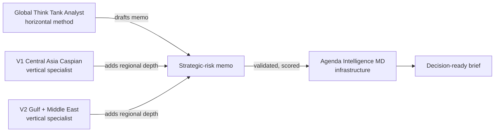

# Global Think Tank Analyst

[](https://github.com/vassiliylakhonin/global-think-tank-analyst/actions/workflows/ci.yml)
[](LICENSE)

**Strategic-risk analysis skill for AI agents.**

A reusable domain skill for agents that produce policy-risk, sanctions, regulatory, geopolitical, trade, and strategic-risk memos.

LLMs are good at summarizing geopolitical events. They are weak at turning them into decision-ready intelligence: framing the decision, separating facts from assessments, stating uncertainty, reasoning through actor incentives, identifying scenarios, and defining what to watch next.

This repository is a domain skill layer that teaches agents how to do that work. It is a behavior contract, not a framework, runtime, or eval platform.

## Try this prompt

Paste this into an AI agent that can reason over policy, sanctions, trade, or geopolitical risk:

```text
Use Global Think Tank Analyst.

Question: What does EU CBAM enforcement-phase exposure change for a Kazakh metals exporter over the next 12 months?
Decision this informs: whether to absorb reporting/compliance cost, pass cost through to EU buyers, or restructure export routing.
Audience: founder / operator.
Geography: Kazakhstan and EU import markets.
Time horizon: 12 months.
Evidence mode: reasoning-only unless you can browse live sources.
Depth: quick brief.

Separate facts, assumptions, assessments, scenarios, and unknowns.
Give options, trade-offs, concrete watch-next indicators, confidence, and what would change the judgment.
```

Expected shape of a good answer:
- opens with the decision being supported, not generic background;
- labels evidence mode and confidence;
- separates facts, assumptions, assessments, scenarios, and unknowns;
- names concrete options with trade-offs;
- ends with observable indicators, not "monitor closely."

## What it does

- frames broad geopolitical or policy questions as decision problems;
- separates facts, assessments, assumptions, scenarios, and unknowns;
- produces structured strategic-risk memos in five modes (quick brief, standard, scenario, red-team, decision pack);
- enforces evidence-boundary language when live verification is not possible;
- avoids unsupported certainty and source theater;
- helps agents produce concrete watch-next indicators and decision triggers;
- gives a reusable analyst behavior contract that travels across runtimes.

## What it is not

- not an autonomous intelligence system;
- not a factuality verifier;
- not a live source retriever or RAG pipeline;
- not legal, compliance, sanctions, or investment advice;
- not a generic agent framework, CLI tool, or MCP server;
- not a benchmarked evaluation framework;
- not a replacement for human analyst judgment.

If you need validation, scoring, evidence audit, schemas, CLI, MCP, or CI checks for outputs produced with this skill, see the companion project [Agenda Intelligence MD](https://github.com/vassiliylakhonin/Agenda-Intelligence-md).

## Portfolio: how this skill composes

Three layers, separately maintained, designed to compose:

| Layer | Repo | What it does |
|---|---|---|
| **Horizontal domain skill** | **Global Think Tank Analyst** (this repo) | The reasoning method and memo modes. Region- and topic-agnostic. |
| **Vertical specialist — V1** | [central-asia-caspian-hybrid-intelligence-skill](https://github.com/vassiliylakhonin/central-asia-caspian-hybrid-intelligence-skill) | Central Asia & Caspian: sanctions, AML, corridors, banking, logistics, energy, geopolitical risk. |
| **Vertical specialist — V2** | [gulf-middle-east-hybrid-intelligence-skill](https://github.com/vassiliylakhonin/gulf-middle-east-hybrid-intelligence-skill) | Gulf & Middle East: Iran sanctions, GCC financial and energy hubs, maritime chokepoint risk (Hormuz, Bab-el-Mandeb, Red Sea), sovereign wealth. |
| **Infrastructure / validation** | [Agenda Intelligence MD](https://github.com/vassiliylakhonin/Agenda-Intelligence-md) | Machine-readable protocol, schemas, validation, scoring, evidence audit, CLI / MCP / CI tooling. |



> Use **Global Think Tank Analyst** for the analyst behavior and memo structure. Bring in a **vertical specialist** when the domain or region needs depth this skill alone cannot provide. Use **Agenda Intelligence MD** to validate, score, and audit the output.

This repo does not duplicate either neighbor. Vertical depth lives in vertical-specialist repos; validation and tooling live in Agenda Intelligence MD.

For a concrete CLI / MCP recipe (score a memo, validate a JSON projection, add an evidence pack), see [`docs/integrations/agenda-intelligence-md.md`](docs/integrations/agenda-intelligence-md.md). For an end-to-end run with **real CLI output** (95/100 brief-only → 83/100 with an honest evidence pack), see [`docs/integrations/agenda-intelligence-md-live-demo.md`](docs/integrations/agenda-intelligence-md-live-demo.md).

## Integration status

| Environment | Status | Notes |
|---|---|---|
| Codex / Cursor / Windsurf | Compatible by repo context | Add `AGENTS.md`, `SKILL.md`, `codex/SKILL.md`, `llms.txt` as context |
| ChatGPT, Claude, Gemini, Perplexity | Compatible by paste/attach | Paste `AGENTS.md` or attach `SKILL.md` |
| OpenClaw / ClawHub | Not actively maintained | Package may not be current; use paste/attach as fallback |
| RAG / internal copilots | Compatible by indexing | Index `README.md`, `SKILL.md`, `AGENTS.md`, `llms.txt`, `signals/` |
| Agenda Intelligence MD | Companion project | Use it for validation, evidence audit, scoring |
| MCP server | Not implemented here | Use Agenda Intelligence MD if MCP is required |
| CLI validation | Not implemented here | Use Agenda Intelligence MD |
| Factuality verification | Not implemented here | This skill enforces *discipline*, not truth |

This repository ships only markdown skill files, examples, eval checklists, and a small signal-generation script. It does not include validators, schemas, or runtimes.

## Quick usage

Paste this into any capable AI agent:

```text
Use Global Think Tank Analyst.

Question: [what we need answered]
Decision this informs: [what action depends on it]
Audience: [founder / operator / investor / compliance / policy team / leadership]
Geography: [countries, regions, corridors, markets]
Time horizon: [days / months / 1–3 years]
Evidence mode: source-backed / reasoning-only / mixed
Depth: quick brief / standard memo / scenario brief / red-team / decision pack

Separate facts, assumptions, assessments, scenarios, and unknowns.
Give options, trade-offs, indicators to watch, and bounded confidence.
```

If the agent has live browsing, ask it to cite sources. If it does not, it must say so and lower confidence.

## Memo modes

| Mode | Use when you need | Typical output |
|---|---|---|
| **A — Quick Brief** | Fast orientation | Bottom line, why it matters, main risks, watchlist, confidence |
| **B — Standard Memo** | Default decision memo | Executive takeaway, context, evidence limits, actors, assessment, options |
| **C — Scenario Brief** | Divergent futures matter | Baseline, 2–4 scenarios, triggers, implications, indicators |
| **D — Red-Team Challenge** | Stress-test a claim | Failure modes, alternative explanations, missing assumptions, revised judgment |
| **E — Decision Briefing Pack** | A team needs to act | Memo, options table, watchlist, questions for owners, next-step cadence |

## Before / after

A generic LLM answer to *"What is the sanctions risk for a European tech firm with operations in Central Asia?"*:

> The geopolitical landscape in Central Asia is complex. Companies should be aware of secondary sanctions risk and monitor developments closely. Engaging stakeholders and remaining agile will be important. Overall the situation requires careful attention.

A Global Think Tank Analyst-style answer to the same question:

> **Question:** Sanctions exposure for a European tech firm operating in Central Asia.
> **Decision:** Whether to expand, hold, or contract Central Asia operations over 12 months.
> **Evidence mode:** reasoning-only.
> EVIDENCE ACCESS LIMITED: no live verification performed in this environment.
>
> **Key judgment (Moderate confidence):** Secondary-sanctions risk is concentrated in dual-use tech and financial-rail exposure, not in general commercial activity. The dominant uncertainty is enforcement posture, not legal text.
>
> **Fact:** EU and US export-control regimes apply extraterritorially to certain dual-use items.
> **Assessment:** Local banking partners, not the firm, are the primary transmission channel for secondary risk.
> **Assumption:** Current sanctions architecture remains broadly stable for 12 months.
> **Scenarios:** (1) Stable enforcement, narrow exposure. (2) Targeted enforcement against re-export corridors raises compliance cost. (3) Broad financial-rail action forces partner switching.
> **Actor incentives:** Local banks want correspondent access; regulators want optionality; the firm wants predictability.
> **Options:** (a) Maintain with stronger partner due diligence; (b) Ring-fence dual-use SKUs; (c) Restructure payment rails through a compliant hub.
> **Watch next:** New OFAC/EU designations naming regional banks; tightening of re-export thresholds; partner KYC escalation.
> **What would change the judgment:** Direct enforcement against a comparable peer; new dual-use list additions covering core SKUs.

The first answer is a tone. The second is a decision input.

## Examples

Worked memos in [`examples/`](examples/), grouped by domain and evidence mode:

For a guided route through the examples, start with [`examples/README.md`](examples/README.md).

| Domain | Evidence mode | File |
|---|---|---|
| Sanctions / AML | live-source-backed | [OFAC Operation Economic Fury (2026-05-01)](examples/live-source-backed-memo.md) — paired with a real [JSON brief](examples/agenda-projections/live-source-backed-memo.brief.json) and [evidence pack](examples/agenda-projections/live-source-backed-memo.evidence.json) |
| Energy / commodities | live-source-backed | [Hormuz disruption and energy prices (May 2026)](examples/live-source-backed-hormuz-energy-prices.md) |
| Regulatory / AI policy | live-source-backed | [EU AI Act simplification (Omnibus VII, 2026-05-07)](examples/live-source-backed-eu-ai-act-simplification.md) |
| Trade / critical minerals | live-source-backed | [China critical-minerals export-controls suspension (Nov 2025 – Nov 2026)](examples/live-source-backed-china-critical-minerals-suspension.md) |
| Trade / customs / climate | live-source-backed | [EU CBAM enforcement-phase exposure (2026)](examples/live-source-backed-cbam-enforcement.md) |
| Monetary policy / corporate finance | live-source-backed | [ECB rate hold under intensifying risks (2026-04-30)](examples/live-source-backed-ecb-rate-hold.md) |
| Sanctions / AML | reasoning-only | [Sanctions exposure memo](examples/sanctions-exposure-memo.md) |
| Regulatory / climate | reasoning-only | [Regulatory impact memo (EU CBAM)](examples/regulatory-impact-memo.md) |
| Export controls | reasoning-only | [Export-controls exposure memo](examples/export-controls-memo.md) |
| Trade / critical minerals | reasoning-only | [Critical-minerals supply-risk memo](examples/critical-minerals-memo.md) |
| Energy / climate policy | reasoning-only | [Energy-transition policy memo](examples/energy-transition-policy-memo.md) |
| Geopolitical / scenarios | reasoning-only | [US–China semiconductor scenario brief](examples/geopolitical-scenario-brief.md) |
| AI governance / strategic competition | reasoning-only | [AI governance regulatory divergence — US, EU, China (18–24 month)](examples/ai-governance-scenario-brief.md) |
| Sanctions / supply-chain | user-provided sources | [Supply-chain sanctions exposure — user brings vendor register, payment rails, and product classification](examples/user-provided-sources-supply-chain-sanctions.md) |
| Sanctions / red-team | reasoning-only | [Red-team policy brief](examples/red-team-policy-brief.md) |

Live-source-backed examples cite real public sources retrieved on 2026-05-08; verify before any operational use. Reasoning-only examples do not cite live sources and are not intelligence products.

## Evaluation

Lightweight, honest review materials in [`evals/`](evals/):

- [`checklist.md`](evals/checklist.md) — human review checklist
- [`failure-modes.md`](evals/failure-modes.md) — common failure patterns
- [`rubric.md`](evals/rubric.md) — starter scoring rubric

These are *human review aids*, not a validated benchmark. For machine-readable validation, scoring, and audit, use [Agenda Intelligence MD](https://github.com/vassiliylakhonin/Agenda-Intelligence-md).

## Signal archive

[`signals/`](signals/) holds short public examples of the skill style: one signal, why it matters, a bounded assessment, and indicators to watch.

The archive is:

- a public set of *examples* of how the skill produces output;
- not official intelligence;
- not investment, legal, or compliance advice;
- not a guarantee of factual verification beyond what each signal explicitly cites.

To contribute a signal, copy [`signals/TEMPLATE.md`](signals/TEMPLATE.md).

## How to consume signals

Use signals as examples of the skill style and as lightweight prompts for deeper memos. They are useful when you want to see how the method handles a current-looking policy, trade, sanctions, regulatory, energy, or macro risk question in compressed form.

Consumption paths:
- read the latest signal at [`signals/latest.md`](signals/latest.md);
- browse the archive through [`signals/index.json`](signals/index.json);
- ingest the JSON Feed at [`signals/feed.json`](signals/feed.json);
- expand any signal by pasting its "Example expansion prompt" into an agent running this skill.

Signals are not real-time intelligence. Before using one for an operational decision, verify the cited sources and current facts.

## Agent-readable endpoints

- [`AGENTS.md`](AGENTS.md) — universal instruction contract for AI agents
- [`SKILL.md`](SKILL.md) — canonical skill behavior
- [`codex/SKILL.md`](codex/SKILL.md) — Codex-ready variant
- [`llms.txt`](llms.txt) — orientation for LLMs and agent indexers
- [`signals/index.json`](signals/index.json) — machine-readable signal index
- [`signals/feed.json`](signals/feed.json) — JSON Feed for ingestion

## Naming

- **Product:** Global Think Tank Analyst
- **Method:** Policy Risk Memo Architect (the analyst behavior the product implements)
- **Companion infrastructure:** Agenda Intelligence MD

## Repository structure

```text
.
├── AGENTS.md             # Universal AI-agent instructions
├── SKILL.md              # Canonical skill behavior
├── codex/SKILL.md        # Codex-ready variant
├── llms.txt              # Agent and LLM indexer orientation
├── examples/             # Worked memo examples
├── evals/                # Human review checklist, failure modes, rubric
├── signals/              # Public signal archive + template
├── scripts/              # Signal generation helper
└── .github/              # CI, issue templates, workflows
```

## Limitations

- This project is intentionally conservative about evidence. It does not fabricate sources, imply live verification when none occurred, or present speculative geopolitical judgments as facts.
- It is a **decision-support skill**, not legal, compliance, investment, sanctions, or intelligence advice.
- It does not verify factuality. It enforces analytical *discipline* — fact/assessment/assumption/scenario/unknown separation, evidence-limit disclosure, scenario framing.
- It does not retrieve sources, run validators, expose an MCP server, or score outputs. For those, use [Agenda Intelligence MD](https://github.com/vassiliylakhonin/Agenda-Intelligence-md).
- Examples in this repo are demonstrations of the skill style across `reasoning-only`, `user-provided sources`, and `live-source-backed` modes. Do not treat them as real intelligence products, and verify current facts before operational use.
- Signals in `signals/` are public examples of the skill style, not official intelligence and not real-time.

## Roadmap

Directional, not committed. Items here are not implemented unless explicitly noted.

**Signal coverage:** expand the archive into trade and monetary-policy domains (US-EU tariffs, interest-rate regime shifts, supply-chain re-routing events). The current archive covers energy, regulatory, critical minerals, and sanctions well; trade and macro are underrepresented.

**Example depth:** a `user-provided-sources` mode example is now included ([supply-chain sanctions exposure](examples/user-provided-sources-supply-chain-sanctions.md)), demonstrating the agent working from the user's own vendor register, payment-rail documentation, and product classification rather than live browsing or reasoning only.

**Vertical specialist expansion:** a second vertical-specialist repo, [gulf-middle-east-hybrid-intelligence-skill](https://github.com/vassiliylakhonin/gulf-middle-east-hybrid-intelligence-skill), is now live (Iran sanctions, GCC banking and sovereign wealth, Hormuz/Bab-el-Mandeb/Red Sea maritime risk). EU regulatory affairs depth is the candidate for a third vertical if demand materialises.

**Eval improvement:** failure-mode patterns are currently derived from the examples and the live integration run. Adding patterns from actual user review feedback would improve the checklist's practical value. Not possible until broader external usage generates structured feedback.

If you'd like to influence the roadmap, open an issue.

## License

MIT — see [LICENSE](LICENSE).
