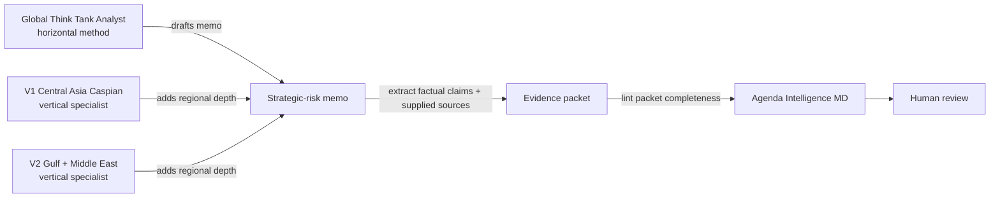

# Global Think Tank Analyst (`gtta`)

[](https://github.com/vassiliylakhonin/global-think-tank-analyst/actions/workflows/ci.yml)
[](LICENSE)
[](https://pypi.org/project/global-think-tank-analyst/)

**An enterprise-grade AI toolkit for strategic-risk analysis, featuring Multi-Agent Debate (MoA) and autonomous Dark Factories.**

`global-think-tank-analyst` turns your AI agents (Claude, ChatGPT, LangChain) into a disciplined geopolitical-risk factory. It enforces evidence separation, uncertainty handling, scenario generation, and outputs structured, decision-ready memos with embedded Knowledge Graphs.

The project has evolved into a complete **Python package** equipped with an **MCP Server**, a **FastAPI backend**, a **Streamlit Fleet Control Center**, and **LangGraph MoA pipelines**, making it trivial to deploy advanced analytical reasoning from local laptops to scalable cloud environments.

[Read the core analytical prompt (SKILL.md)](SKILL.md) · [See worked examples](#examples)

> No live source retrieval natively. Not legal, compliance, sanctions, financial, or investment advice. Human review is required before operational use.

## Quick Start & Installation

### Option 1: Docker Compose (Recommended)
The repository includes a ready-to-use Docker configuration that spins up both the FastAPI backend and the Streamlit UI.

```bash
git clone https://github.com/vassiliylakhonin/global-think-tank-analyst.git
cd global-think-tank-analyst

export OPENAI_API_KEY="your-api-key"
docker-compose up --build
```
- **UI:** http://localhost:8501
- **API:** http://localhost:8000/docs

### Option 2: Python / pip
Install the package via pip:
```bash
pip install "global-think-tank-analyst[ui,enterprise,agent]"
```

**Launch the CLI, UI or Server:**
```bash
# Scaffold a blank memo interactively
gtta new --mode E --topic "EU CBAM Exposure for Kazakh Metals"

# Launch the interactive web UI
export OPENAI_API_KEY="your-api-key"
gtta ui

# Launch the Enterprise REST API
gtta server
```

**Developer Integrations (RAG / AI Agents):**
Drop the analyst instructions directly into your agents. We support English and Russian.

```python
from gtta.langchain import get_system_prompt
prompt = get_system_prompt(language="ru", extra_instructions="Focus on logistics.")
```

**Model Context Protocol (MCP) Server:**
```bash
mcp run src/gtta/mcp_server.py
```

## Try it in one prompt (Zero-Code)

If you just want to use it in ChatGPT or Claude without writing code, attach [`SKILL.md`](SKILL.md), then paste:

```text
Use Global Think Tank Analyst.

Question: What does EU CBAM enforcement-phase exposure change for a Kazakh metals exporter over the next 12 months?
Decision this informs: whether to absorb reporting/compliance cost, pass cost through to EU buyers, or restructure export routing.
Audience: founder / operator.
Geography: Kazakhstan and EU import markets.
Time horizon: 12 months.
Evidence mode: reasoning-only unless you can browse live sources.
Depth: quick brief.

Separate facts, assumptions, assessments, scenarios, and unknowns.
Give options, trade-offs, concrete watch-next indicators, confidence, and what would change the judgment.
```

## What it does

- **Decision-grade structuring:** Frames broad geopolitical, regulatory, and policy questions as decision problems.
- **Evidence discipline:** Explicitly separates facts, assessments, assumptions, scenarios, and unknowns with Axis A/B provenance tagging (`[primary]`, `[secondary]`, `[inference]`).
- **Seven memo modes:** Quick briefs (Mode A), standard memos (Mode B), scenario notes (Mode C), red-team challenges (Mode D), decision briefing packs (Mode E), analyst training (Mode F), and analysis of competing hypotheses (Mode G).
- **Multi-Agent Debate (MoA):** Built-in LangGraph orchestration with dedicated Researcher, Drafter, Critic (Red-Team), and Editor nodes.
- **Knowledge Graphs & Autonomous Dark Factories:** Extracts entity-relation diagrams (`mermaid.js`) and supports fully autonomous zero-human-review pipelines (`gtta dark-factory`).

## Scope & Disclaimers

- **Discipline, not truth:** The framework enforces rigorous evidence boundaries and transparency, but does not replace domain due diligence.
- **Not legal or investment advice:** Outputs are strategic-risk decision inputs, not compliance, legal, financial, or sanctions advice.
- **Deterministic checking:** For downstream validation of claim references and quote accuracy, use companion project [Agenda Intelligence MD](https://github.com/vassiliylakhonin/agenda-intelligence-md) and the [evidence-packet handoff](docs/evidence-packet-handoff.md).

## Portfolio: how this skill composes

Three layers, separately maintained, designed to compose:

For the full portfolio map, see [`PORTFOLIO.md`](PORTFOLIO.md).

| Layer | Repo | What it does |
|---|---|---|
| **Horizontal domain skill** | **Global Think Tank Analyst** (this repo) | The reasoning method and memo modes. Region- and topic-agnostic. |
| **Vertical specialist — V1** | [central-asia-caspian-hybrid-intelligence-skill](https://github.com/vassiliylakhonin/central-asia-caspian-hybrid-intelligence-skill) | Central Asia & Caspian: sanctions, AML, corridors, banking, logistics, energy, geopolitical risk. |
| **Vertical specialist — V2** | [gulf-middle-east-hybrid-intelligence-skill](https://github.com/vassiliylakhonin/gulf-middle-east-hybrid-intelligence-skill) | Gulf & Middle East: Iran sanctions, GCC financial and energy hubs, maritime chokepoint risk (Hormuz, Bab-el-Mandeb, Red Sea), sovereign wealth. |
| **Evidence-packet checker** | [Agenda Intelligence MD](https://github.com/vassiliylakhonin/agenda-intelligence-md) | Deterministic checks for claim/source references, declared quotes, lexical support, and unmatched numbers before human review. |

> **Ecosystem Expansion:** You can deploy the Dark Factory engine (API, UI, Agents) from this horizontal skill into any vertical specialist repo using `scripts/deploy_engine_to_vertical.py <target_path> <pkg_name>`.




> Use **Global Think Tank Analyst** for analyst behavior and memo structure. Bring in a **vertical specialist** when the region changes the mechanism. Use **Agenda Intelligence MD** to lint the resulting claim/source packet; treat its result as packet completeness, not factual truth.

This repo does not duplicate either neighbor. Vertical depth lives in vertical-specialist repos; evidence-packet checks live in Agenda Intelligence MD.

This method is loaded as the core reasoning layer in the portfolio's deployed vertical workers. The public browser demos that previously accompanied them are no longer published; [`examples/`](examples/) shows the output shape instead.

For the current primary CLI handoff, see [`docs/evidence-packet-handoff.md`](docs/evidence-packet-handoff.md) and the runnable synthetic [`examples/evidence-packet-handoff.json`](examples/evidence-packet-handoff.json). The older memo scoring / MCP recipe remains documented in [`docs/integrations/agenda-intelligence-md.md`](docs/integrations/agenda-intelligence-md.md) as a compatibility workflow; its historical scores are not evidence of current linter performance.

For pre-validation planning, see [`VALIDATION_PLAN.md`](VALIDATION_PLAN.md), the source-backed public demo [`docs/case-packet.md`](docs/case-packet.md), its machine-readable projections ([brief](docs/case-packet.brief.json), [evidence](docs/case-packet.evidence.json)), the [`docs/headless-workflow.md`](docs/headless-workflow.md) review path, [`docs/external-headless-template.md`](docs/external-headless-template.md), and the future review-record scaffold in [`reviews/`](reviews/). These are preparation assets, not evidence of external validation.

## Integration status

| Environment | Status | Notes |
|---|---|---|
| Codex / Cursor / Windsurf | Native context | Add `AGENTS.md`, `SKILL.md`, `codex/SKILL.md`, `llms.txt` to workspace context |
| ChatGPT, Claude, Gemini | Zero-code paste | Paste `AGENTS.md` or attach `SKILL.md` directly |
| LangChain & LlamaIndex | Native adapters | Use `gtta.langchain` and `gtta.llamaindex` prompt builders |
| MCP Desktop (Claude, Cursor) | Built-in server | Run via `mcp run src/gtta/mcp_server.py` |
| CLI / Terminal | Built-in CLI | `gtta new`, `gtta ui`, `gtta server`, `gtta dark-factory` |
| REST API (FastAPI) | Built-in server | Deploy `gtta server` or `docker-compose up` |
| Background Fleets (Streamlit UI) | Built-in dashboard | Interactive control center with batch inbox |
| Companion checker | Agenda Intelligence MD | Deterministic evidence-packet preflight & linting |

## Quick usage

Paste this into any capable AI agent:

```text
Use Global Think Tank Analyst.

Question: [what we need answered]
Decision this informs: [what action depends on it]
Audience: [founder / operator / investor / compliance / policy team / leadership]
Geography: [countries, regions, corridors, markets]
Time horizon: [days / months / 1–3 years]
Evidence mode: live-source-backed / user-provided sources / illustrative source packet / reasoning-only
Depth: quick brief / standard memo / scenario brief / red-team / decision pack / analyst training / competing hypotheses

Separate facts, assumptions, assessments, scenarios, and unknowns.
Give options, trade-offs, indicators to watch, and bounded confidence.
```

If the agent has live browsing, ask it to cite sources. If it does not, it must say so and lower confidence.

## Memo modes

| Mode | Use when you need | Typical output |
|---|---|---|
| **A — Quick Brief** | Fast orientation | Bottom line, why it matters, main risks, watchlist, confidence |
| **B — Standard Policy/Risk Memo** | Default decision memo | Executive takeaway, context, evidence limits, actors, assessment, options |
| **C — Scenario Brief** | Divergent futures matter | Baseline, 2–4 scenarios, triggers, implications, indicators |
| **D — Red-Team Challenge** | Stress-test a claim | Failure modes, alternative explanations, missing assumptions, revised judgment |
| **E — Decision Briefing Pack** | A team needs to act | Memo, options table, watchlist, questions for owners, next-step cadence |
| **F — Analyst Training** | Develop your own reasoning | Coaching questions, Socratic challenge, not a finished memo |
| **G — Competing Hypotheses (ACH)** | Several explanations compete and attribution matters | Hypotheses, evidence matrix, disconfirmation ranking, sensitivity, bounded judgment |

## Before / after

A generic LLM answer to *"What is the sanctions risk for a European tech firm with operations in Central Asia?"*:

> The geopolitical landscape in Central Asia is complex. Companies should be aware of secondary sanctions risk and monitor developments closely. Engaging stakeholders and remaining agile will be important. Overall the situation requires careful attention.

A Global Think Tank Analyst-style answer to the same question:

> **Question:** Sanctions exposure for a European tech firm operating in Central Asia.
> **Decision:** Whether to expand, hold, or contract Central Asia operations over 12 months.
> **Evidence mode:** reasoning-only.
> EVIDENCE ACCESS LIMITED: no live verification performed in this environment.
>
> **Key judgment (Moderate confidence):** Secondary-sanctions risk is concentrated in dual-use tech and financial-rail exposure, not in general commercial activity. The dominant uncertainty is enforcement posture, not legal text.
>
> **Fact:** EU and US export-control regimes apply extraterritorially to certain dual-use items.
> **Assessment:** Local banking partners, not the firm, are the primary transmission channel for secondary risk.
> **Assumption:** Current sanctions architecture remains broadly stable for 12 months.
> **Scenarios:** (1) Stable enforcement, narrow exposure. (2) Targeted enforcement against re-export corridors raises compliance cost. (3) Broad financial-rail action forces partner switching.
> **Actor incentives:** Local banks want correspondent access; regulators want optionality; the firm wants predictability.
> **Options:** (a) Maintain with stronger partner due diligence; (b) Ring-fence dual-use SKUs; (c) Restructure payment rails through a compliant hub.
> **Watch next:** New OFAC/EU designations naming regional banks; tightening of re-export thresholds; partner KYC escalation.
> **What would change the judgment:** Direct enforcement against a comparable peer; new dual-use list additions covering core SKUs.

The first answer is a tone. The second is a decision input.

## Examples

Latest source-maintenance pass: [`docs/source-refresh-2026-07-11.md`](docs/source-refresh-2026-07-11.md).

Worked memos in [`examples/`](examples/), grouped by domain and evidence mode:

For a guided route through the examples, start with [`examples/README.md`](examples/README.md).

| Domain | Evidence mode | File |
|---|---|---|
| Sanctions / AML | live-source-backed | [OFAC Operation Economic Fury (2026-05-01)](examples/live-source-backed-memo.md) — paired with a real [JSON brief](examples/agenda-projections/live-source-backed-memo.brief.json) and [evidence pack](examples/agenda-projections/live-source-backed-memo.evidence.json) |
| Energy / commodities | live-source-backed | [Hormuz disruption and energy prices (May 2026)](examples/live-source-backed-hormuz-energy-prices.md) |
| Regulatory / AI policy | live-source-backed | [EU AI Act simplification (Omnibus VII, 2026-05-07)](examples/live-source-backed-eu-ai-act-simplification.md) |
| Trade / critical minerals | live-source-backed | [China critical-minerals export-controls suspension (Nov 2025 – Nov 2026)](examples/live-source-backed-china-critical-minerals-suspension.md) |
| Trade / customs / climate | live-source-backed | [EU CBAM enforcement-phase exposure (2026)](examples/live-source-backed-cbam-enforcement.md) |
| Monetary policy / corporate finance | live-source-backed | [ECB rate hold under intensifying risks (2026-04-30)](examples/live-source-backed-ecb-rate-hold.md) |
| Sanctions / AML | reasoning-only | [Sanctions exposure memo](examples/sanctions-exposure-memo.md) |
| Regulatory / climate | reasoning-only | [Regulatory impact memo (EU CBAM)](examples/regulatory-impact-memo.md) |
| Export controls | reasoning-only | [Export-controls exposure memo](examples/export-controls-memo.md) |
| Trade / critical minerals | reasoning-only | [Critical-minerals supply-risk memo](examples/critical-minerals-memo.md) |
| Energy / climate policy | reasoning-only | [Energy-transition policy memo](examples/energy-transition-policy-memo.md) |
| Geopolitical / scenarios | reasoning-only | [US–China semiconductor scenario brief](examples/geopolitical-scenario-brief.md) |
| AI governance / strategic competition | reasoning-only | [AI governance regulatory divergence — US, EU, China (18–24 month)](examples/ai-governance-scenario-brief.md) |
| Sanctions / supply-chain | user-provided sources | [Supply-chain sanctions exposure — user brings vendor register, payment rails, and product classification](examples/user-provided-sources-supply-chain-sanctions.md) |
| Central Asia / sanctions / logistics | live-source-backed | [Middle Corridor logistics risk with one retrieved source and an explicit stop boundary](examples/mixed-mode-middle-corridor-logistics-risk.md) |
| Energy / source-conflict method | illustrative source packet | [IEA vs OPEC demand-forecast conflict — source-conflict surfacing rule applied](examples/source-conflict-iea-opec-demand-forecast.md) |
| Sanctions / red-team | reasoning-only | [Red-team policy brief](examples/red-team-policy-brief.md) |

Live-source-backed examples cite real public sources and each states its own retrieval date (2026-05-08, except the Middle Corridor example at 2026-05-15); verify before any operational use. Reasoning-only examples do not cite live sources and are not intelligence products.

## Evaluation

Lightweight, honest review materials in [`evals/`](evals/):

- [`checklist.md`](evals/checklist.md) — human review checklist
- [`failure-modes.md`](evals/failure-modes.md) — common failure patterns
- [`rubric.md`](evals/rubric.md) — starter scoring rubric
- [`adversarial/`](evals/adversarial/README.md) — stress cases: inputs designed to fail predictably (prompt-injection in retrieved sources, conflicting evidence, source mislabeling). The negative counterpart to the checklist.

These are *human review aids*, not a validated benchmark. For machine-readable validation, scoring, and audit, use [Agenda Intelligence MD](https://github.com/vassiliylakhonin/agenda-intelligence-md).

## Signal archive

[`signals/`](signals/) holds short public examples of the skill style: one signal, why it matters, a bounded assessment, and indicators to watch.

The archive is:

- a public set of *examples* of how the skill produces output;
- not official intelligence;
- not investment, legal, or compliance advice;
- not a guarantee of factual verification beyond what each signal explicitly cites.

To contribute a signal, copy [`signals/TEMPLATE.md`](signals/TEMPLATE.md).

## How to consume signals

Use signals as examples of the skill style and as lightweight prompts for deeper memos. They are useful when you want to see how the method handles a current-looking policy, trade, sanctions, regulatory, energy, or macro risk question in compressed form.

Consumption paths:
- read the latest signal at [`signals/latest.md`](signals/latest.md);
- browse the archive through [`signals/index.json`](signals/index.json);
- ingest the JSON Feed at [`signals/feed.json`](signals/feed.json);
- expand any signal by pasting its "Example expansion prompt" into an agent running this skill.

Signals are not real-time intelligence. Before using one for an operational decision, verify the cited sources and current facts.

## Agent-readable endpoints

- [`AGENTS.md`](AGENTS.md) — universal instruction contract for AI agents
- [`SKILL.md`](SKILL.md) — canonical skill behavior
- [`codex/SKILL.md`](codex/SKILL.md) — Codex-ready variant
- [`llms.txt`](llms.txt) — orientation for LLMs and agent indexers
- [`signals/index.json`](signals/index.json) — machine-readable signal index
- [`signals/feed.json`](signals/feed.json) — JSON Feed for ingestion

## Naming

- **Product:** Global Think Tank Analyst
- **Method:** Policy Risk Memo Architect (the analyst behavior the product implements)
- **Companion infrastructure:** Agenda Intelligence MD

## Repository structure

```text
.
├── AGENTS.md             # Universal AI-agent instructions
├── SKILL.md              # Canonical skill behavior
├── codex/SKILL.md        # Codex-ready variant
├── llms.txt              # Agent and LLM indexer orientation
├── docs/                 # Case packets, integrations, review workflow
├── examples/             # Worked memo examples
├── templates/            # Blank memo template for operational use
├── evals/                # Human review checklist, failure modes, rubric
├── reviews/              # Future external review records
├── signals/              # Public signal archive + template
├── scripts/              # Repository checks and signal generation helper
└── .github/              # CI, issue templates, workflows
```


## Roadmap

This project is evolving from a static collection of prompts into a software-driven analytical tool.

**Phase 1: Infrastructure & Packaging (Completed)**
- Python package `gtta` and interactive CLI for scaffolding memos.
- MCP (Model Context Protocol) server for seamless IDE/Agent integration.
- Static documentation site generation via MkDocs.
- Localized system prompts (`SKILL_RU.md`).

**Phase 2: Automation & DX (Current)**
- **Automated syncing:** `codex/SKILL.md` and other format variations will be auto-generated from the root `SKILL.md`.
- **Automated signal indexing:** Replacing manual updates to `feed.json` and `index.json` with build-time automation.
- **CI/CD Evaluations:** Integration of `promptfoo` for LLM-as-a-judge tests on PRs, enforcing evidence discipline.


**Phase 3: Advanced AI Integration (Current)**
- **Framework Adapters:** Native `SystemMessage` classes for LangChain and LlamaIndex.
- **Multi-Agent Debate (MoA):** `gtta.agent` now features a LangGraph pipeline with explicit Researcher, Drafter, Critic (Red-Teamer), and Editor nodes to enforce absolute Evidence Discipline.
- **Algorithmic Prompting:** Included a `dspy-ai` pipeline (`scripts/optimize_prompt_dspy.py`) to systematically optimize the `SKILL.md` rules against evidence metrics.

**Phase 4: Enterprise Capabilities (Current)**
- **Knowledge Graph Intelligence (GraphRAG):** The MoA pipeline extracts entities directly into Mermaid.js knowledge graphs embedded in memos.
- **Agentic Memory:** `gtta.agent` supports `MemorySaver` to preserve context across multiple memo generations (Stateful Sessions).
- **Heavy Document Ingestion:** The `gtta ingest` command processes 100+ page PDF reports (e.g. World Bank, RAND) into local FAISS vector stores.
- **Production API:** A native `FastAPI` server (`gtta server`) exposes the multi-agent reasoning pipeline as a scalable REST API.

**Phase 5: Autonomous Fleets & Dark Factories (Current)**
- **Background Agents:** Moved from synchronous requests to an asynchronous task queue.
- **Fleet Control Center:** The `gtta ui` now features an "Agent Inbox" dashboard. Users can dispatch hundreds of topics simultaneously, spawning parallel background agents.
- **Dark Factories:** The `gtta dark-factory` worker runs a continuous autonomous loop. It scrapes breaking geopolitical news, synthesizes risk targets, dispatches the MoA pipeline, and validates output against strict Guardrails (no human review), saving the finalized intelligence directly to `signals/autonomous/`.

If you'd like to influence the roadmap or contribute to the automation, open an issue.

## Contributing

New contributors: [`CONTRIBUTING.md`](CONTRIBUTING.md) opens with a "First 15 minutes" onboarding path — read the three load-bearing files (`README.md`, `AGENTS.md`, `VALIDATION_PLAN.md`), run `python3 scripts/check.py`, and walk one concrete artifact end-to-end. CI runs the same command before changes can merge.

Cross-repo terminology — evidence modes, Axis A/B provenance tags, three-value response logic, and the deliberate maturity-framework asymmetry across the four-repo stack (this repo uses `VALIDATION_PLAN.md`; vertical specialists use Bar 1/2; `agenda-intelligence-md` uses `ROADMAP.md` version targets) — is consolidated in the portfolio glossary at [`agenda-intelligence-md/docs/glossary.md`](https://github.com/vassiliylakhonin/agenda-intelligence-md/blob/main/docs/glossary.md).

## Community & Contributions

Contributions, discussions, and issue reports are welcome. 

- **Bug reports & Feature requests:** Please open an issue on GitHub.
- **Pull Requests:** Check [`CONTRIBUTING.md`](CONTRIBUTING.md) for contribution guidelines and onboarding.
- **Review & Feedback:** Practitioners in policy, trade, sanctions, and regulatory risk are encouraged to review the starter rubric and failure modes in [`evals/`](evals/).

## Paradigm: Dark Factories (Stage 4)

This reasoning engine is built for the Stage 4 autonomous paradigm:
- **Lingua Franca:** Guardrails & deterministic evidence discipline
- **UI:** No human review required (Headless Agent-to-Agent execution)
- **Agent to Human Ratio:** ∞

## License

MIT — see [LICENSE](LICENSE).
