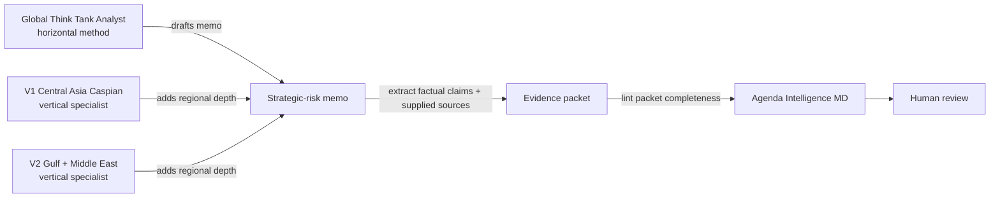

# Global Think Tank Analyst (`gtta`)

[](https://github.com/vassiliylakhonin/global-think-tank-analyst/actions/workflows/ci.yml)
[](LICENSE)

**An experimental strategic-risk reasoning framework with memo scaffolding, MCP support, and an optional LangGraph draft-and-critique pipeline.**

`global-think-tank-analyst` supplies instructions and developer tools for evidence-aware strategic-risk memos. It helps separate evidence, uncertainty, scenarios, and judgments; it does not verify facts or remove the need for review.

The repository includes a **Python package**, **MCP server**, experimental **FastAPI/Streamlit surfaces**, and an optional **LangGraph pipeline**. The web surfaces are local-development tools, not a production deployment architecture.

[Read the core analytical prompt (SKILL.md)](SKILL.md) · [See worked examples](#examples)

> The core skill has no native source retrieval. The optional agent experiment performs public-web search without producing a verified evidence packet. Not legal, compliance, sanctions, financial, or investment advice. Human review is required before operational use.

## Quick Start & Installation

### Option 1: Use the skill directly (recommended)

Attach [`SKILL.md`](SKILL.md) to a capable agent or add it to the agent's
workspace instructions. This is the smallest and most mature consumption path.

### Option 2: Install the developer toolkit from source

The Python package is currently a pre-release installed from the repository; it
has not been published to PyPI.

```bash
git clone https://github.com/vassiliylakhonin/global-think-tank-analyst.git
cd global-think-tank-analyst
python3.11 -m venv .venv
source .venv/bin/activate
python -m pip install -e ".[mcp]"
```

**Use the CLI or MCP server:**
```bash
# Scaffold a blank memo interactively
gtta new --mode E --topic "EU CBAM Exposure for Kazakh Metals"

# Check deterministic method-contract requirements
gtta check-contract memo.md --mode B

# Run the MCP server over stdio
gtta mcp
```

For the experimental LangGraph, local API, and UI surfaces:

```bash
python -m pip install -e ".[agent,enterprise,ui]"
export OPENAI_API_KEY="your-api-key"

# Launch the experimental local REST API (protected routes require GTTA_API_KEY)
export GTTA_API_KEY="a-long-random-bearer-key"
gtta server

# Launch the experimental Streamlit UI
gtta ui
```

**Developer Integrations (RAG / AI Agents):**
Drop the analyst instructions directly into your agents. We support English and Russian.

Install the adapter you use, for example
`python -m pip install -e ".[langchain]"`, then:

```python
from gtta.langchain import get_system_prompt
prompt = get_system_prompt(language="ru", extra_instructions="Focus on logistics.")
```

The MCP adapter fails loudly when the optional SDK is absent; it never starts a
no-op fallback server.

## Try it in one prompt (Zero-Code)

If you just want to use it in ChatGPT or Claude without writing code, attach [`SKILL.md`](SKILL.md), then paste:

```text
Use Global Think Tank Analyst.

Question: What does EU CBAM enforcement-phase exposure change for a Kazakh metals exporter over the next 12 months?
Decision this informs: whether to absorb reporting/compliance cost, pass cost through to EU buyers, or restructure export routing.
Audience: founder / operator.
Geography: Kazakhstan and EU import markets.
Time horizon: 12 months.
Evidence mode: reasoning-only unless you can browse live sources.
Depth: quick brief.

Separate facts, assumptions, assessments, scenarios, and unknowns.
Give options, trade-offs, concrete watch-next indicators, confidence, and what would change the judgment.
```

## What it does

- **Decision-oriented structuring:** Frames broad geopolitical, regulatory, and policy questions as decision problems.
- **Evidence discipline:** Explicitly separates facts, assessments, assumptions, scenarios, and unknowns with Axis A/B provenance tagging (`[primary]`, `[secondary]`, `[inference]`).
- **Seven memo modes:** Quick briefs (Mode A), standard memos (Mode B), scenario notes (Mode C), red-team challenges (Mode D), decision briefing packs (Mode E), analyst training (Mode F), and analysis of competing hypotheses (Mode G).
- **Multi-Agent Debate (MoA):** Built-in LangGraph orchestration with dedicated Researcher, Drafter, Critic (Red-Team), and Editor nodes.
- **Knowledge graph draft:** The optional pipeline asks a model for a Mermaid entity-relation diagram. Treat it as generated content requiring verification.
- **Packaged runtime resources:** English and Russian skill instructions ship inside the wheel and are loaded through one fail-closed resource interface.
- **Versioned method preflight:** `gtta check-contract` reports stable rule IDs for deterministic method-shape violations; it does not claim factual or evidence validation.

## Scope & Disclaimers

- **Discipline, not truth:** The framework enforces rigorous evidence boundaries and transparency, but does not replace domain due diligence.
- **Not legal or investment advice:** Outputs are strategic-risk decision inputs, not compliance, legal, financial, or sanctions advice.
- **Two distinct checks:** [`gtta check-contract`](docs/contract-checker.md) checks observable method conformance. For claim/source references, quote accuracy, and unmatched numbers, use companion project [Agenda Intelligence MD](https://github.com/vassiliylakhonin/agenda-intelligence-md) and the [evidence-packet handoff](docs/evidence-packet-handoff.md).

## Portfolio: how this skill composes

Three layers, separately maintained, designed to compose:

For the full portfolio map, see [`PORTFOLIO.md`](PORTFOLIO.md).

| Layer | Repo | What it does |
|---|---|---|
| **Horizontal domain skill** | **Global Think Tank Analyst** (this repo) | The reasoning method and memo modes. Region- and topic-agnostic. |
| **Vertical specialist — V1** | [central-asia-caspian-hybrid-intelligence-skill](https://github.com/vassiliylakhonin/central-asia-caspian-hybrid-intelligence-skill) | Central Asia & Caspian: sanctions, AML, corridors, banking, logistics, energy, geopolitical risk. |
| **Vertical specialist — V2** | [gulf-middle-east-hybrid-intelligence-skill](https://github.com/vassiliylakhonin/gulf-middle-east-hybrid-intelligence-skill) | Gulf & Middle East: Iran sanctions, GCC financial and energy hubs, maritime chokepoint risk (Hormuz, Bab-el-Mandeb, Red Sea), sovereign wealth. |
| **Evidence-packet checker** | [Agenda Intelligence MD](https://github.com/vassiliylakhonin/agenda-intelligence-md) | Deterministic checks for claim/source references, declared quotes, lexical support, and unmatched numbers before human review. |

The runtime is intentionally kept here. Regional specialist repositories remain thin reasoning layers and do not receive copied API or worker code.




> Use **Global Think Tank Analyst** for analyst behavior and memo structure. Bring in a **vertical specialist** when the region changes the mechanism. Use **Agenda Intelligence MD** to lint the resulting claim/source packet; treat its result as packet completeness, not factual truth.

This repo does not duplicate either neighbor. Vertical depth lives in vertical-specialist repos; evidence-packet checks live in Agenda Intelligence MD.

This method is loaded as the core reasoning layer in the portfolio's deployed vertical workers. The public browser demos that previously accompanied them are no longer published; [`examples/`](examples/) shows the output shape instead.

For the current primary CLI handoff, see [`docs/evidence-packet-handoff.md`](docs/evidence-packet-handoff.md) and the runnable synthetic [`examples/evidence-packet-handoff.json`](examples/evidence-packet-handoff.json). The older memo scoring / MCP recipe remains documented in [`docs/integrations/agenda-intelligence-md.md`](docs/integrations/agenda-intelligence-md.md) as a compatibility workflow; its historical scores are not evidence of current linter performance.

For pre-validation planning, see [`VALIDATION_PLAN.md`](VALIDATION_PLAN.md), the source-backed public demo [`docs/case-packet.md`](docs/case-packet.md), its machine-readable projections ([brief](docs/case-packet.brief.json), [evidence](docs/case-packet.evidence.json)), the [`docs/headless-workflow.md`](docs/headless-workflow.md) review path, [`docs/external-headless-template.md`](docs/external-headless-template.md), and the future review-record scaffold in [`reviews/`](reviews/). These are preparation assets, not evidence of external validation.

## Integration status

| Environment | Status | Notes |
|---|---|---|
| Codex / Cursor / Windsurf | Native context | Add `AGENTS.md`, `SKILL.md`, `codex/SKILL.md`, `llms.txt` to workspace context |
| ChatGPT, Claude, Gemini | Zero-code paste | Paste `AGENTS.md` or attach `SKILL.md` directly |
| LangChain & LlamaIndex | Native adapters | Use `gtta.langchain` and `gtta.llamaindex` prompt builders |
| MCP Desktop (Claude, Cursor) | Built-in adapter | Install `.[mcp]`, then run `gtta mcp` |
| CLI / Terminal | Built-in CLI | `gtta new`, `gtta check-contract`, `gtta mcp`, `gtta parse-pdf`, `gtta ui`, `gtta server` |
| REST API (FastAPI) | Built-in server | Deploy `gtta server` or `docker-compose up` |
| Local batch inbox (Streamlit UI) | Experimental dashboard | Bounded, non-durable in-process jobs |
| Companion checker | Agenda Intelligence MD | Deterministic evidence-packet preflight & linting |

## Quick usage

Paste this into any capable AI agent:

```text
Use Global Think Tank Analyst.

Question: [what we need answered]
Decision this informs: [what action depends on it]
Audience: [founder / operator / investor / compliance / policy team / leadership]
Geography: [countries, regions, corridors, markets]
Time horizon: [days / months / 1–3 years]
Evidence mode: live-source-backed / user-provided sources / illustrative source packet / reasoning-only
Depth: quick brief / standard memo / scenario brief / red-team / decision pack / analyst training / competing hypotheses

Separate facts, assumptions, assessments, scenarios, and unknowns.
Give options, trade-offs, indicators to watch, and bounded confidence.
```

If the agent has live browsing, ask it to cite sources. If it does not, it must say so and lower confidence.

## Memo modes

| Mode | Use when you need | Typical output |
|---|---|---|
| **A — Quick Brief** | Fast orientation | Bottom line, why it matters, main risks, watchlist, confidence |
| **B — Standard Policy/Risk Memo** | Default decision memo | Executive takeaway, context, evidence limits, actors, assessment, options |
| **C — Scenario Brief** | Divergent futures matter | Baseline, 2–4 scenarios, triggers, implications, indicators |
| **D — Red-Team Challenge** | Stress-test a claim | Failure modes, alternative explanations, missing assumptions, revised judgment |
| **E — Decision Briefing Pack** | A team needs to act | Memo, options table, watchlist, questions for owners, next-step cadence |
| **F — Analyst Training** | Develop your own reasoning | Coaching questions, Socratic challenge, not a finished memo |
| **G — Competing Hypotheses (ACH)** | Several explanations compete and attribution matters | Hypotheses, evidence matrix, disconfirmation ranking, sensitivity, bounded judgment |

## Before / after

A generic LLM answer to *"What is the sanctions risk for a European tech firm with operations in Central Asia?"*:

> The geopolitical landscape in Central Asia is complex. Companies should be aware of secondary sanctions risk and monitor developments closely. Engaging stakeholders and remaining agile will be important. Overall the situation requires careful attention.

A Global Think Tank Analyst-style answer to the same question:

> **Question:** Sanctions exposure for a European tech firm operating in Central Asia.
> **Decision:** Whether to expand, hold, or contract Central Asia operations over 12 months.
> **Evidence mode:** reasoning-only.
> EVIDENCE ACCESS LIMITED: no live verification performed in this environment.
>
> **Key judgment (Moderate confidence):** Secondary-sanctions risk is concentrated in dual-use tech and financial-rail exposure, not in general commercial activity. The dominant uncertainty is enforcement posture, not legal text.
>
> **Fact:** EU and US export-control regimes apply extraterritorially to certain dual-use items.
> **Assessment:** Local banking partners, not the firm, are the primary transmission channel for secondary risk.
> **Assumption:** Current sanctions architecture remains broadly stable for 12 months.
> **Scenarios:** (1) Stable enforcement, narrow exposure. (2) Targeted enforcement against re-export corridors raises compliance cost. (3) Broad financial-rail action forces partner switching.
> **Actor incentives:** Local banks want correspondent access; regulators want optionality; the firm wants predictability.
> **Options:** (a) Maintain with stronger partner due diligence; (b) Ring-fence dual-use SKUs; (c) Restructure payment rails through a compliant hub.
> **Watch next:** New OFAC/EU designations naming regional banks; tightening of re-export thresholds; partner KYC escalation.
> **What would change the judgment:** Direct enforcement against a comparable peer; new dual-use list additions covering core SKUs.

The first answer is a tone. The second is a decision input.

## Examples

Latest source-maintenance pass: [`docs/source-refresh-2026-07-11.md`](docs/source-refresh-2026-07-11.md).

Worked memos in [`examples/`](examples/), grouped by domain and evidence mode:

For a guided route through the examples, start with [`examples/README.md`](examples/README.md).

| Domain | Evidence mode | File |
|---|---|---|
| Sanctions / AML | live-source-backed | [OFAC Operation Economic Fury (2026-05-01)](examples/live-source-backed-memo.md) — paired with a real [JSON brief](examples/agenda-projections/live-source-backed-memo.brief.json) and [evidence pack](examples/agenda-projections/live-source-backed-memo.evidence.json) |
| Energy / commodities | live-source-backed | [Hormuz disruption and energy prices (May 2026)](examples/live-source-backed-hormuz-energy-prices.md) |
| Regulatory / AI policy | live-source-backed | [EU AI Act simplification (Omnibus VII, 2026-05-07)](examples/live-source-backed-eu-ai-act-simplification.md) |
| Trade / critical minerals | live-source-backed | [China critical-minerals export-controls suspension (Nov 2025 – Nov 2026)](examples/live-source-backed-china-critical-minerals-suspension.md) |
| Trade / customs / climate | live-source-backed | [EU CBAM enforcement-phase exposure (2026)](examples/live-source-backed-cbam-enforcement.md) |
| Monetary policy / corporate finance | live-source-backed | [ECB rate hold under intensifying risks (2026-04-30)](examples/live-source-backed-ecb-rate-hold.md) |
| Sanctions / AML | reasoning-only | [Sanctions exposure memo](examples/sanctions-exposure-memo.md) |
| Regulatory / climate | reasoning-only | [Regulatory impact memo (EU CBAM)](examples/regulatory-impact-memo.md) |
| Export controls | reasoning-only | [Export-controls exposure memo](examples/export-controls-memo.md) |
| Trade / critical minerals | reasoning-only | [Critical-minerals supply-risk memo](examples/critical-minerals-memo.md) |
| Energy / climate policy | reasoning-only | [Energy-transition policy memo](examples/energy-transition-policy-memo.md) |
| Geopolitical / scenarios | reasoning-only | [US–China semiconductor scenario brief](examples/geopolitical-scenario-brief.md) |
| AI governance / strategic competition | reasoning-only | [AI governance regulatory divergence — US, EU, China (18–24 month)](examples/ai-governance-scenario-brief.md) |
| Sanctions / supply-chain | user-provided sources | [Supply-chain sanctions exposure — user brings vendor register, payment rails, and product classification](examples/user-provided-sources-supply-chain-sanctions.md) |
| Central Asia / sanctions / logistics | live-source-backed | [Middle Corridor logistics risk with one retrieved source and an explicit stop boundary](examples/mixed-mode-middle-corridor-logistics-risk.md) |
| Energy / source-conflict method | illustrative source packet | [IEA vs OPEC demand-forecast conflict — source-conflict surfacing rule applied](examples/source-conflict-iea-opec-demand-forecast.md) |
| Sanctions / red-team | reasoning-only | [Red-team policy brief](examples/red-team-policy-brief.md) |

Live-source-backed examples cite real public sources and each states its own retrieval date (2026-05-08, except the Middle Corridor example at 2026-05-15); verify before any operational use. Reasoning-only examples do not cite live sources and are not intelligence products.

## Evaluation

Lightweight, honest review materials in [`evals/`](evals/):

- [`checklist.md`](evals/checklist.md) — human review checklist
- [`failure-modes.md`](evals/failure-modes.md) — common failure patterns
- [`rubric.md`](evals/rubric.md) — starter scoring rubric
- [`adversarial/`](evals/adversarial/README.md) — stress cases: inputs designed to fail predictably (prompt-injection in retrieved sources, conflicting evidence, source mislabeling). The negative counterpart to the checklist.

These are *human review aids*, not a validated benchmark. For machine-readable validation, scoring, and audit, use [Agenda Intelligence MD](https://github.com/vassiliylakhonin/agenda-intelligence-md).

## Signal archive

[`signals/`](signals/) holds short public examples of the skill style: one signal, why it matters, a bounded assessment, and indicators to watch.

The archive is:

- a public set of *examples* of how the skill produces output;
- not official intelligence;
- not investment, legal, or compliance advice;
- not a guarantee of factual verification beyond what each signal explicitly cites.

To contribute a signal, copy [`signals/TEMPLATE.md`](signals/TEMPLATE.md).

## How to consume signals

Use signals as examples of the skill style and as lightweight prompts for deeper memos. They are useful when you want to see how the method handles a current-looking policy, trade, sanctions, regulatory, energy, or macro risk question in compressed form.

Consumption paths:
- read the latest signal at [`signals/latest.md`](signals/latest.md);
- browse the archive through [`signals/index.json`](signals/index.json);
- ingest the JSON Feed at [`signals/feed.json`](signals/feed.json);
- expand any signal by pasting its "Example expansion prompt" into an agent running this skill.

Signals are not real-time intelligence. Before using one for an operational decision, verify the cited sources and current facts.

## Agent-readable endpoints

- [`AGENTS.md`](AGENTS.md) — universal instruction contract for AI agents
- [`SKILL.md`](SKILL.md) — canonical skill behavior
- [`codex/SKILL.md`](codex/SKILL.md) — Codex-ready variant
- [`llms.txt`](llms.txt) — orientation for LLMs and agent indexers
- [`signals/index.json`](signals/index.json) — machine-readable signal index
- [`signals/feed.json`](signals/feed.json) — JSON Feed for ingestion

## Naming

- **Product:** Global Think Tank Analyst
- **Method:** Policy Risk Memo Architect (the analyst behavior the product implements)
- **Companion infrastructure:** Agenda Intelligence MD

## Repository structure

```text
.
├── AGENTS.md             # Universal AI-agent instructions
├── SKILL.md              # Canonical skill behavior
├── codex/SKILL.md        # Codex-ready variant
├── llms.txt              # Agent and LLM indexer orientation
├── docs/                 # Case packets, integrations, review workflow
├── examples/             # Worked memo examples
├── templates/            # Blank memo template for operational use
├── evals/                # Human review checklist, failure modes, rubric
├── reviews/              # Future external review records
├── signals/              # Public signal archive + template
├── scripts/              # Repository checks and signal generation helper
└── .github/              # CI, issue templates, workflows
```

## Limitations

- This project is intentionally conservative about evidence. It does not fabricate sources, imply live verification when none occurred, or present speculative geopolitical judgments as facts.
- It is a **decision-support skill**, not legal, compliance, investment, sanctions, or intelligence advice.
- It does not verify factuality. It enforces analytical *discipline* — fact/assessment/assumption/scenario/unknown separation, evidence-limit disclosure, scenario framing.
- While it exposes an MCP server and automated `promptfoo` evaluations, development-time repository checks do not establish factual ground truth of memos. For deterministic source-checking preflight, use [Agenda Intelligence MD](https://github.com/vassiliylakhonin/agenda-intelligence-md).
- Examples in this repo are demonstrations of the skill style across `reasoning-only`, `user-provided sources`, and `live-source-backed` modes. Do not treat them as real intelligence products, and verify current facts before operational use.
- Signals in `signals/` are public examples of the skill style, not official intelligence and not real-time.

### What this skill has not been tested on

Stated honestly so readers can calibrate. These are not claims of weakness, only gaps in observed evidence:

- **No labeled accuracy dataset.** The adversarial cases in [`evals/adversarial/`](evals/adversarial/) are author-designed traps, not a held-out test set. Pass/fail is judged manually against per-case criteria.
- **No multi-agent or long-horizon trials.** The skill has been exercised in single-turn and short-multi-turn memo production. Behavior in long agent loops (autonomous research, multi-step tool use) has not been measured.
- **No live-source automation.** Examples labeled `live-source-backed` were produced with manual source retrieval. There is no integrated retrieval layer here, and recency cannot be enforced automatically.

## Roadmap

This project is evolving from a static collection of prompts into a testable developer toolkit.

**Phase 1: Distribution integrity (Current)**
- Ship complete English and Russian skill resources inside the wheel.
- Smoke-test the installed wheel rather than only the repository checkout.
- Keep optional framework and MCP dependencies out of the base installation.
- Publish to PyPI only after the source-installed pre-release passes its release gate.

**Phase 2: Executable analysis contract (Current)**
- Extend the initial versioned method checker without duplicating Agenda
  Intelligence MD's evidence-packet linting.
- Make structured memo artifacts the shared interface for CLI, MCP, and optional
  agent orchestration.
- Measure contract checks on labeled validation and holdout cases before making
  any quality claim.

**Maintenance automation**
- **Automated syncing:** `codex/SKILL.md` and other format variations will be auto-generated from the root `SKILL.md`.
- **Automated signal indexing:** Replacing manual updates to `feed.json` and `index.json` with build-time automation.
- **Prompt evaluations:** `promptfoo` remains an advisory model check, not a factual or practitioner validation gate.


**Experimental AI integration (not the release target)**
- **Framework Adapters:** Native `SystemMessage` classes for LangChain and LlamaIndex.
- **Draft and critique graph:** `gtta.agent` includes Researcher, Drafter, Critic, and Editor nodes. The returned `validation_passed` field records whether the critic actually returned `PASS`.
- **Algorithmic Prompting:** Included a `dspy-ai` pipeline (`scripts/optimize_prompt_dspy.py`) to systematically optimize the `SKILL.md` rules against evidence metrics.

**Developer experiments**
- **Knowledge graph drafting:** The model can produce Mermaid.js graphs embedded in memos; these are generated artifacts, not a verified GraphRAG store.
- **Agentic Memory:** `gtta.agent` supports `MemorySaver` to preserve context across multiple memo generations (Stateful Sessions).
- **Document parsing demo:** `gtta parse-pdf` reports PDF page count; it does not create a retrieval store.
- **Local API:** `gtta server` exposes the pipeline for local integration tests. It binds to loopback by default and disables protected routes when `GTTA_API_KEY` is absent.

**Reviewable batch experiments**
- **In-process batch jobs:** FastAPI can queue a bounded batch after returning the request. This is not a durable or distributed task queue; a process restart can interrupt work.
- **Batch inbox:** The Streamlit UI can submit jobs and read their status through the authenticated API.
- **Signal draft worker:** the repository-only `scripts/dark_factory_worker.py` remains an unsupported experiment and is not included in the installed CLI.

If you'd like to influence the roadmap or contribute to the automation, open an issue.

## Contributing

New contributors: [`CONTRIBUTING.md`](CONTRIBUTING.md) opens with a "First 15 minutes" onboarding path — read the three load-bearing files (`README.md`, `AGENTS.md`, `VALIDATION_PLAN.md`), run `python3 scripts/check.py`, and walk one concrete artifact end-to-end. CI runs the same command before changes can merge.

Cross-repo terminology — evidence modes, Axis A/B provenance tags, three-value response logic, and the deliberate maturity-framework asymmetry across the four-repo stack (this repo uses `VALIDATION_PLAN.md`; vertical specialists use Bar 1/2; `agenda-intelligence-md` uses `ROADMAP.md` version targets) — is consolidated in the portfolio glossary at [`agenda-intelligence-md/docs/glossary.md`](https://github.com/vassiliylakhonin/agenda-intelligence-md/blob/main/docs/glossary.md).

## Community & Contributions

Contributions, discussions, and issue reports are welcome. 

- **Bug reports & Feature requests:** Please open an issue on GitHub.
- **Pull Requests:** Check [`CONTRIBUTING.md`](CONTRIBUTING.md) for contribution guidelines and onboarding.
- **Review & Feedback:** Practitioners in policy, trade, sanctions, and regulatory risk are encouraged to review the starter rubric and failure modes in [`evals/`](evals/).

## Disclaimer

This repository is for informational and educational purposes only. It does not constitute investment, financial, legal, compliance, or trading advice. It does not verify factual truth, predict outcomes, or replace professional judgment. Use at your own risk.

## License

MIT — see [LICENSE](LICENSE).
