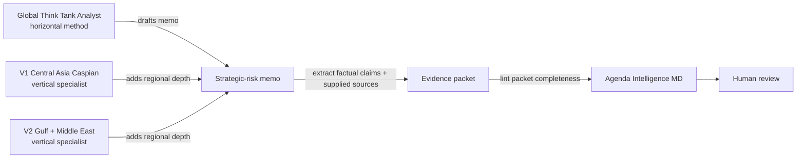

# Global Think Tank Analyst

[](https://github.com/vassiliylakhonin/global-think-tank-analyst/actions/workflows/ci.yml)
[](LICENSE)

> **STRATEGIC-RISK REASONING CONTRACT FOR AI AGENTS** — a domain reasoning contract that runs inside AI agents and produces structured policy-risk, sanctions, regulatory, geopolitical and trade memos with decision framing, evidence boundaries, scenarios and confidence. Open-source. No live data. No legal, compliance or investment advice.

> **Horizontal reasoning method in the Agenda Intelligence portfolio.** Use directly via paste/attach into Claude, ChatGPT, Codex, or another agent. When sources are supplied, export the memo's externally checkable claims through the [evidence-packet handoff](docs/evidence-packet-handoff.md) and run Agenda Intelligence MD before human review.

**Strategic-risk analysis skill for AI agents.**

A reusable domain skill for agents that produce policy-risk, sanctions, regulatory, geopolitical, trade, and strategic-risk memos.

LLMs are good at summarizing geopolitical events. They are weak at turning them into decision-ready intelligence: framing the decision, separating facts from assessments, stating uncertainty, reasoning through actor incentives, identifying scenarios, and defining what to watch next.

This repository is a domain skill layer that teaches agents how to do that work. It is a behavior contract, not a framework, runtime, or eval platform.

## Commercial role

This repo is a **reasoning-method dependency**, not a commercial product surface. [Agenda Intelligence MD](https://github.com/vassiliylakhonin/agenda-intelligence-md) is now primarily a deterministic evidence-packet linter for claim-backed AI output; the older strategic-intelligence runtime remains available for compatibility.

Use Global Think Tank Analyst to improve the reasoning inside evidence-readiness artifacts: RFP teardowns, vendor evidence packets, risk memos, and human-review packets. Do not treat this repo's existence, examples, or signal archive as market validation for any Agenda Intelligence MD wedge. It should not grow buyer-facing surfaces, pricing, vertical workers, or procurement positioning on its own.

## Who it is for

- AI engineers and product teams building strategic-risk, sanctions, policy or geopolitical-risk agents
- analysts, consultants and researchers using AI assistants for memo work in policy, trade, regulation or sanctions
- risk, compliance and policy leadership whose AI tools must produce decision-ready output instead of generic regional or topical commentary
- reviewers and editors of AI-produced memos who need explicit evidence boundaries and uncertainty labels

**Where this fits in the Agenda Intelligence stack**

This repo is the **reasoning method** layer. It can be used standalone or inside the older `analyze` compatibility workflow. The current primary composition is: reasoning method → optional regional specialist → claim/source packet → Agenda Intelligence MD linter → human review.

The skills define how agents *reason*. Agenda Intelligence MD checks whether the supplied claim/source packet is structurally ready for review. It does not establish factual truth.

## Try this prompt

Paste this into an AI agent that can reason over policy, sanctions, trade, or geopolitical risk:

```text
Use Global Think Tank Analyst.

Question: What does EU CBAM enforcement-phase exposure change for a Kazakh metals exporter over the next 12 months?
Decision this informs: whether to absorb reporting/compliance cost, pass cost through to EU buyers, or restructure export routing.
Audience: founder / operator.
Geography: Kazakhstan and EU import markets.
Time horizon: 12 months.
Evidence mode: reasoning-only unless you can browse live sources.
Depth: quick brief.

Separate facts, assumptions, assessments, scenarios, and unknowns.
Give options, trade-offs, concrete watch-next indicators, confidence, and what would change the judgment.
```

Expected shape of a good answer:
- opens with the decision being supported, not generic background;
- labels evidence mode and confidence;
- separates facts, assumptions, assessments, scenarios, and unknowns;
- names concrete options with trade-offs;
- ends with observable indicators, not "monitor closely."

## What it does

- frames broad geopolitical or policy questions as decision problems;
- separates facts, assessments, assumptions, scenarios, and unknowns;
- produces structured strategic-risk memos in six modes (quick brief, standard, scenario, red-team, decision pack, analyst training);
- enforces evidence-boundary language when live verification is not possible;
- avoids unsupported certainty and source theater;
- helps agents produce concrete watch-next indicators and decision triggers;
- gives a reusable analyst behavior contract that travels across runtimes.

## What it is not

- not an autonomous intelligence system;
- not a factuality verifier;
- not a live source retriever or RAG pipeline;
- not legal, compliance, sanctions, or investment advice;
- not a generic agent framework, CLI tool, or MCP server;
- not a benchmarked evaluation framework;
- not a replacement for human analyst judgment.

If you need deterministic checks for source references, declared quotes, lexical support, or unmatched numbers, use the companion project [Agenda Intelligence MD](https://github.com/vassiliylakhonin/agenda-intelligence-md) and the [evidence-packet handoff](docs/evidence-packet-handoff.md). Its older memo validation, scoring, and MCP surfaces remain compatibility options.

## Portfolio: how this skill composes

Three layers, separately maintained, designed to compose:

For the full portfolio map, see [`PORTFOLIO.md`](PORTFOLIO.md).

| Layer | Repo | What it does |
|---|---|---|
| **Horizontal domain skill** | **Global Think Tank Analyst** (this repo) | The reasoning method and memo modes. Region- and topic-agnostic. |
| **Vertical specialist — V1** | [central-asia-caspian-hybrid-intelligence-skill](https://github.com/vassiliylakhonin/central-asia-caspian-hybrid-intelligence-skill) | Central Asia & Caspian: sanctions, AML, corridors, banking, logistics, energy, geopolitical risk. |
| **Vertical specialist — V2** | [gulf-middle-east-hybrid-intelligence-skill](https://github.com/vassiliylakhonin/gulf-middle-east-hybrid-intelligence-skill) | Gulf & Middle East: Iran sanctions, GCC financial and energy hubs, maritime chokepoint risk (Hormuz, Bab-el-Mandeb, Red Sea), sovereign wealth. |
| **Evidence-packet checker** | [Agenda Intelligence MD](https://github.com/vassiliylakhonin/agenda-intelligence-md) | Deterministic checks for claim/source references, declared quotes, lexical support, and unmatched numbers before human review. |



> Use **Global Think Tank Analyst** for analyst behavior and memo structure. Bring in a **vertical specialist** when the region changes the mechanism. Use **Agenda Intelligence MD** to lint the resulting claim/source packet; treat its result as packet completeness, not factual truth.

This repo does not duplicate either neighbor. Vertical depth lives in vertical-specialist repos; evidence-packet checks live in Agenda Intelligence MD.

This method is loaded as the core reasoning layer in the portfolio's deployed vertical workers. Two have interactive browser demos you can run live: [Middle Corridor Deal Risk Gate](https://vassiliylakhonin.github.io/deal-risk-gate.html) and [CIS Secondary-Sanctions Exposure](https://vassiliylakhonin.github.io/cis-secondary-sanctions.html). Evidence triage only, not advice.

For the current primary CLI handoff, see [`docs/evidence-packet-handoff.md`](docs/evidence-packet-handoff.md) and the runnable synthetic [`examples/evidence-packet-handoff.json`](examples/evidence-packet-handoff.json). The older memo scoring / MCP recipe remains documented in [`docs/integrations/agenda-intelligence-md.md`](docs/integrations/agenda-intelligence-md.md) as a compatibility workflow; its historical scores are not evidence of current linter performance.

For pre-validation planning, see [`VALIDATION_PLAN.md`](VALIDATION_PLAN.md), the source-backed public demo [`docs/case-packet.md`](docs/case-packet.md), its machine-readable projections ([brief](docs/case-packet.brief.json), [evidence](docs/case-packet.evidence.json)), the [`docs/reviewer-workflow.md`](docs/reviewer-workflow.md) review path, [`docs/external-review-template.md`](docs/external-review-template.md), and the future review-record scaffold in [`reviews/`](reviews/). These are preparation assets, not evidence of external validation.

## Integration status

| Environment | Status | Notes |
|---|---|---|
| Codex / Cursor / Windsurf | Compatible by repo context | Add `AGENTS.md`, `SKILL.md`, `codex/SKILL.md`, `llms.txt` as context |
| ChatGPT, Claude, Gemini, Perplexity | Compatible by paste/attach | Paste `AGENTS.md` or attach `SKILL.md` |
| OpenClaw / ClawHub | Not actively maintained | Package may not be current; use paste/attach as fallback |
| RAG / internal copilots | Compatible by indexing | Index `README.md`, `SKILL.md`, `AGENTS.md`, `llms.txt`, `signals/` |
| Agenda Intelligence MD | Companion checker | Use it for deterministic evidence-packet preflight; older memo validation and scoring are compatibility surfaces |
| MCP server | Not implemented here | Use Agenda Intelligence MD if MCP is required |
| CLI validation | Not implemented here | Use Agenda Intelligence MD |
| Factuality verification | Not implemented here | This skill enforces *discipline*, not truth |

This repository ships only markdown skill files, examples, eval checklists, and a small signal-generation script. It does not include validators, schemas, or runtimes.

## Quick usage

Paste this into any capable AI agent:

```text
Use Global Think Tank Analyst.

Question: [what we need answered]
Decision this informs: [what action depends on it]
Audience: [founder / operator / investor / compliance / policy team / leadership]
Geography: [countries, regions, corridors, markets]
Time horizon: [days / months / 1–3 years]
Evidence mode: live-source-backed / user-provided sources / illustrative source packet / reasoning-only
Depth: quick brief / standard memo / scenario brief / red-team / decision pack / analyst training

Separate facts, assumptions, assessments, scenarios, and unknowns.
Give options, trade-offs, indicators to watch, and bounded confidence.
```

If the agent has live browsing, ask it to cite sources. If it does not, it must say so and lower confidence.

## Memo modes

| Mode | Use when you need | Typical output |
|---|---|---|
| **A — Quick Brief** | Fast orientation | Bottom line, why it matters, main risks, watchlist, confidence |
| **B — Standard Memo** | Default decision memo | Executive takeaway, context, evidence limits, actors, assessment, options |
| **C — Scenario Brief** | Divergent futures matter | Baseline, 2–4 scenarios, triggers, implications, indicators |
| **D — Red-Team Challenge** | Stress-test a claim | Failure modes, alternative explanations, missing assumptions, revised judgment |
| **E — Decision Briefing Pack** | A team needs to act | Memo, options table, watchlist, questions for owners, next-step cadence |
| **F — Analyst Training** | Develop your own reasoning | Coaching questions, Socratic challenge, not a finished memo |

## Before / after

A generic LLM answer to *"What is the sanctions risk for a European tech firm with operations in Central Asia?"*:

> The geopolitical landscape in Central Asia is complex. Companies should be aware of secondary sanctions risk and monitor developments closely. Engaging stakeholders and remaining agile will be important. Overall the situation requires careful attention.

A Global Think Tank Analyst-style answer to the same question:

> **Question:** Sanctions exposure for a European tech firm operating in Central Asia.
> **Decision:** Whether to expand, hold, or contract Central Asia operations over 12 months.
> **Evidence mode:** reasoning-only.
> EVIDENCE ACCESS LIMITED: no live verification performed in this environment.
>
> **Key judgment (Moderate confidence):** Secondary-sanctions risk is concentrated in dual-use tech and financial-rail exposure, not in general commercial activity. The dominant uncertainty is enforcement posture, not legal text.
>
> **Fact:** EU and US export-control regimes apply extraterritorially to certain dual-use items.
> **Assessment:** Local banking partners, not the firm, are the primary transmission channel for secondary risk.
> **Assumption:** Current sanctions architecture remains broadly stable for 12 months.
> **Scenarios:** (1) Stable enforcement, narrow exposure. (2) Targeted enforcement against re-export corridors raises compliance cost. (3) Broad financial-rail action forces partner switching.
> **Actor incentives:** Local banks want correspondent access; regulators want optionality; the firm wants predictability.
> **Options:** (a) Maintain with stronger partner due diligence; (b) Ring-fence dual-use SKUs; (c) Restructure payment rails through a compliant hub.
> **Watch next:** New OFAC/EU designations naming regional banks; tightening of re-export thresholds; partner KYC escalation.
> **What would change the judgment:** Direct enforcement against a comparable peer; new dual-use list additions covering core SKUs.

The first answer is a tone. The second is a decision input.

## Examples

Latest source-maintenance pass: [`docs/source-refresh-2026-07-11.md`](docs/source-refresh-2026-07-11.md).

Worked memos in [`examples/`](examples/), grouped by domain and evidence mode:

For a guided route through the examples, start with [`examples/README.md`](examples/README.md).

| Domain | Evidence mode | File |
|---|---|---|
| Sanctions / AML | live-source-backed | [OFAC Operation Economic Fury (2026-05-01)](examples/live-source-backed-memo.md) — paired with a real [JSON brief](examples/agenda-projections/live-source-backed-memo.brief.json) and [evidence pack](examples/agenda-projections/live-source-backed-memo.evidence.json) |
| Energy / commodities | live-source-backed | [Hormuz disruption and energy prices (May 2026)](examples/live-source-backed-hormuz-energy-prices.md) |
| Regulatory / AI policy | live-source-backed | [EU AI Act simplification (Omnibus VII, 2026-05-07)](examples/live-source-backed-eu-ai-act-simplification.md) |
| Trade / critical minerals | live-source-backed | [China critical-minerals export-controls suspension (Nov 2025 – Nov 2026)](examples/live-source-backed-china-critical-minerals-suspension.md) |
| Trade / customs / climate | live-source-backed | [EU CBAM enforcement-phase exposure (2026)](examples/live-source-backed-cbam-enforcement.md) |
| Monetary policy / corporate finance | live-source-backed | [ECB rate hold under intensifying risks (2026-04-30)](examples/live-source-backed-ecb-rate-hold.md) |
| Sanctions / AML | reasoning-only | [Sanctions exposure memo](examples/sanctions-exposure-memo.md) |
| Regulatory / climate | reasoning-only | [Regulatory impact memo (EU CBAM)](examples/regulatory-impact-memo.md) |
| Export controls | reasoning-only | [Export-controls exposure memo](examples/export-controls-memo.md) |
| Trade / critical minerals | reasoning-only | [Critical-minerals supply-risk memo](examples/critical-minerals-memo.md) |
| Energy / climate policy | reasoning-only | [Energy-transition policy memo](examples/energy-transition-policy-memo.md) |
| Geopolitical / scenarios | reasoning-only | [US–China semiconductor scenario brief](examples/geopolitical-scenario-brief.md) |
| AI governance / strategic competition | reasoning-only | [AI governance regulatory divergence — US, EU, China (18–24 month)](examples/ai-governance-scenario-brief.md) |
| Sanctions / supply-chain | user-provided sources | [Supply-chain sanctions exposure — user brings vendor register, payment rails, and product classification](examples/user-provided-sources-supply-chain-sanctions.md) |
| Central Asia / sanctions / logistics | live-source-backed | [Middle Corridor logistics risk with one retrieved source and an explicit stop boundary](examples/mixed-mode-middle-corridor-logistics-risk.md) |
| Energy / source-conflict method | illustrative source packet | [IEA vs OPEC demand-forecast conflict — source-conflict surfacing rule applied](examples/source-conflict-iea-opec-demand-forecast.md) |
| Sanctions / red-team | reasoning-only | [Red-team policy brief](examples/red-team-policy-brief.md) |

Live-source-backed examples cite real public sources retrieved on 2026-05-08; verify before any operational use. Reasoning-only examples do not cite live sources and are not intelligence products.

## Evaluation

Lightweight, honest review materials in [`evals/`](evals/):

- [`checklist.md`](evals/checklist.md) — human review checklist
- [`failure-modes.md`](evals/failure-modes.md) — common failure patterns
- [`rubric.md`](evals/rubric.md) — starter scoring rubric
- [`adversarial/`](evals/adversarial/README.md) — stress cases: inputs designed to fail predictably (prompt-injection in retrieved sources, conflicting evidence, source mislabeling). The negative counterpart to the checklist.

These are *human review aids*, not a validated benchmark. For machine-readable validation, scoring, and audit, use [Agenda Intelligence MD](https://github.com/vassiliylakhonin/agenda-intelligence-md).

## Signal archive

[`signals/`](signals/) holds short public examples of the skill style: one signal, why it matters, a bounded assessment, and indicators to watch.

The archive is:

- a public set of *examples* of how the skill produces output;
- not official intelligence;
- not investment, legal, or compliance advice;
- not a guarantee of factual verification beyond what each signal explicitly cites.

To contribute a signal, copy [`signals/TEMPLATE.md`](signals/TEMPLATE.md).

## How to consume signals

Use signals as examples of the skill style and as lightweight prompts for deeper memos. They are useful when you want to see how the method handles a current-looking policy, trade, sanctions, regulatory, energy, or macro risk question in compressed form.

Consumption paths:
- read the latest signal at [`signals/latest.md`](signals/latest.md);
- browse the archive through [`signals/index.json`](signals/index.json);
- ingest the JSON Feed at [`signals/feed.json`](signals/feed.json);
- expand any signal by pasting its "Example expansion prompt" into an agent running this skill.

Signals are not real-time intelligence. Before using one for an operational decision, verify the cited sources and current facts.

## Agent-readable endpoints

- [`AGENTS.md`](AGENTS.md) — universal instruction contract for AI agents
- [`SKILL.md`](SKILL.md) — canonical skill behavior
- [`codex/SKILL.md`](codex/SKILL.md) — Codex-ready variant
- [`llms.txt`](llms.txt) — orientation for LLMs and agent indexers
- [`signals/index.json`](signals/index.json) — machine-readable signal index
- [`signals/feed.json`](signals/feed.json) — JSON Feed for ingestion

## Naming

- **Product:** Global Think Tank Analyst
- **Method:** Policy Risk Memo Architect (the analyst behavior the product implements)
- **Companion infrastructure:** Agenda Intelligence MD

## Repository structure

```text
.
├── AGENTS.md             # Universal AI-agent instructions
├── SKILL.md              # Canonical skill behavior
├── codex/SKILL.md        # Codex-ready variant
├── llms.txt              # Agent and LLM indexer orientation
├── docs/                 # Case packets, integrations, review workflow
├── examples/             # Worked memo examples
├── templates/            # Blank memo template for operational use
├── evals/                # Human review checklist, failure modes, rubric
├── reviews/              # Future external review records
├── signals/              # Public signal archive + template
├── scripts/              # Signal generation helper
└── .github/              # CI, issue templates, workflows
```

## Limitations

- This project is intentionally conservative about evidence. It does not fabricate sources, imply live verification when none occurred, or present speculative geopolitical judgments as facts.
- It is a **decision-support skill**, not legal, compliance, investment, sanctions, or intelligence advice.
- It does not verify factuality. It enforces analytical *discipline* — fact/assessment/assumption/scenario/unknown separation, evidence-limit disclosure, scenario framing.
- It does not retrieve sources, run validators, expose an MCP server, or score outputs. For those, use [Agenda Intelligence MD](https://github.com/vassiliylakhonin/agenda-intelligence-md).
- Examples in this repo are demonstrations of the skill style across `reasoning-only`, `user-provided sources`, and `live-source-backed` modes. Do not treat them as real intelligence products, and verify current facts before operational use.
- Signals in `signals/` are public examples of the skill style, not official intelligence and not real-time.

### What this skill has not been tested on

Stated honestly so readers can calibrate. These are not claims of weakness, only gaps in observed evidence:

- **No labeled accuracy dataset.** The adversarial cases in [`evals/adversarial/`](evals/adversarial/) are author-designed traps, not a held-out test set. Pass/fail is judged manually against per-case criteria.
- **No multi-agent or long-horizon trials.** The skill has been exercised in single-turn and short-multi-turn memo production. Behavior in long agent loops (autonomous research, multi-step tool use) has not been measured.
- **No cross-model regression tracking.** Behavior has been observed primarily on Claude. Other model families may produce different outputs against the same memo modes and provenance rules.
- **No live-source automation.** Examples labeled `live-source-backed` were produced with manual source retrieval. There is no integrated retrieval layer here, and recency cannot be enforced automatically.
- **Limited coverage of non-English regulatory text.** Examples and signals are predominantly English-source. Behavior on source material in other languages, especially where translation introduces nuance, has not been systematically reviewed.

## Roadmap

Directional, not committed. Items here are open, not yet implemented.

**Signal coverage:** the archive now covers energy, regulatory, critical minerals, sanctions, trade (US-EU, US-China), and monetary policy (Fed posture, central-bank divergence). Open gaps where future signals would add the most value: supply-chain re-routing events, sovereign-debt / fiscal stress in major economies, and EU regulatory implementation milestones.

**Third vertical specialist:** EU regulatory affairs depth is a candidate if demand materialises. The Gulf & Middle East vertical is already live at [gulf-middle-east-hybrid-intelligence-skill](https://github.com/vassiliylakhonin/gulf-middle-east-hybrid-intelligence-skill).

**Eval improvement:** failure-mode patterns are currently derived from the examples and the live integration run. Adding patterns from actual user review feedback would improve the checklist's practical value. Not possible until broader external usage generates structured feedback.

If you'd like to influence the roadmap, open an issue.

## Contributing

New contributors: [`CONTRIBUTING.md`](CONTRIBUTING.md) opens with a "First 15 minutes" onboarding path — read the three load-bearing files (`README.md`, `AGENTS.md`, `VALIDATION_PLAN.md`), run the three validators (`validate_signals.py`, `validate_json.py`, `validate_examples.py`), and walk one concrete artifact end-to-end. CI hard-stops on all three validators; run them locally before pushing.

Cross-repo terminology — evidence modes, Axis A/B provenance tags, three-value response logic, and the deliberate maturity-framework asymmetry across the four-repo stack (this repo uses `VALIDATION_PLAN.md`; vertical specialists use Bar 1/2; `agenda-intelligence-md` uses `ROADMAP.md` version targets) — is consolidated in the portfolio glossary at [`agenda-intelligence-md/docs/glossary.md`](https://github.com/vassiliylakhonin/agenda-intelligence-md/blob/main/docs/glossary.md).

## Contact

Author: **Vassiliy Lakhonin** — Almaty, Kazakhstan (UTC+5).

- Portfolio: [vassiliylakhonin.github.io](https://vassiliylakhonin.github.io/)
- Analyst entry route: [vassiliylakhonin.github.io/for-analysts.html](https://vassiliylakhonin.github.io/for-analysts.html)
- Email: [vassiliy.lakhonin@gmail.com](mailto:vassiliy.lakhonin@gmail.com)
- LinkedIn: [linkedin.com/in/vassiliy-lakhonin](https://www.linkedin.com/in/vassiliy-lakhonin/)
- GitHub: [github.com/vassiliylakhonin](https://github.com/vassiliylakhonin)
- Issues and PRs on this repo are welcome.

For external review of an example or the starter rubric (sanctions, regulatory, energy-trading, policy or trade practitioners), please open an issue or email with your background. For bespoke analysis under retainer, email with decision context, geography and time horizon.

## Disclaimer

This repository is for informational and educational purposes only. It does not constitute investment, financial, legal, compliance, or trading advice. It does not verify factual truth, predict outcomes, or replace professional judgment. Use at your own risk.

## License

MIT — see [LICENSE](LICENSE).
